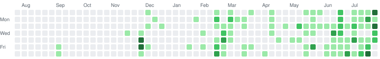
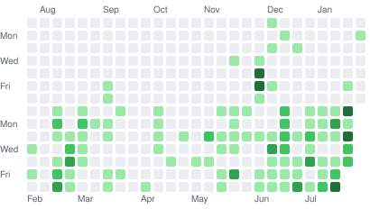
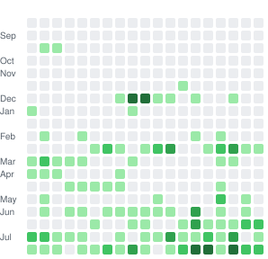

<div align="center">

# contribution-life

**Your contribution graph, running Conway's Game of Life.**

Pure SVG and CSS keyframes — no JavaScript, no GIF, no runtime.
Drop one workflow in and it regenerates every day.

<picture>
  <source media="(prefers-color-scheme: dark)" srcset="docs/demo-calendar-dark.svg">
  
</picture>

<sub>The loop holds your real graph, runs Life on it, and cuts back.</sub>

</div>

---

## Use it

Add `.github/workflows/contribution-life.yml` to your profile repository:

```yaml
name: contribution-life
on:
  schedule: [{ cron: "17 3 * * *" }]
  workflow_dispatch:
permissions:
  contents: write
jobs:
  build:
    runs-on: ubuntu-latest
    steps:
      - uses: satomasahiro2005/contribution-life@v1
        with:
          github_token: ${{ secrets.GITHUB_TOKEN }}
      - run: |
          git config user.name github-actions[bot]
          git config user.email 41898282+github-actions[bot]@users.noreply.github.com
          git checkout --orphan output
          git rm -rf . >/dev/null 2>&1 || true
          mv dist/*.svg .
          git add ./*.svg && git commit -m "contribution-life $(date -u +%F)"
          git push -f origin output
```

Run it once, then put this in your README:

```html
<picture>
  <source media="(prefers-color-scheme: dark)"
          srcset="https://raw.githubusercontent.com/USER/REPO/output/contribution-life-dark.svg">
  
</picture>
```

Or run it locally — standard library only, nothing to install:

```bash
GITHUB_TOKEN=$(gh auth token) python glife.py fetch --login YOUR_NAME
python glife.py render
```

## Pick a shape

Seven rows is very thin for Life. `layout` reshapes the same year of data, and it
changes how long the colony survives more than anything else does.

<table>
<tr><td colspan="2">

**`calendar`** &nbsp; 53×7 &nbsp;·&nbsp; the familiar one

<picture>
  <source media="(prefers-color-scheme: dark)" srcset="docs/demo-calendar-dark.svg">
  
</picture>

</td></tr>
<tr><td valign="top">

**`split`** &nbsp; 27×7 twice &nbsp;·&nbsp; half the year per band

<picture>
  <source media="(prefers-color-scheme: dark)" srcset="docs/demo-split-dark.svg">
  
</picture>

</td><td valign="top">

**`square`** &nbsp; 19×19 = 361 &nbsp;·&nbsp; the last 361 days packed row-major

<picture>
  <source media="(prefers-color-scheme: dark)" srcset="docs/demo-square-dark.svg">
  
</picture>

</td></tr>
</table>

Population of B3/S23 over 100 generations, same seed, edges wrapped:

| layout | shape | median | second half | |
| --- | --- | --- | --- | --- |
| `calendar` | 53×7 | 9% | 5% | thins out past ~gen 45 |
| `split` | 27×14 | 3% | 3% | thins out faster |
| `square` | 19×19 | 12% | **16%** | never collapses, recovers |

## It tunes itself

`gens` and `seed_level` default to auto. Every threshold is actually simulated
and cut at the first generation where the board dies out or stops changing; the
one that runs longest wins. Contribution graphs vary enormously and no fixed
setting works for all of them:

| | graph | picked | result |
| --- | --- | --- | --- |
| a quiet year | 13% full | `L1+`, 25 gens | 13–51 live |
| a normal year | 27% full | `L1+`, 66 gens | 43–103 live |
| a busy year | 95% full | `L2+`, 100 gens | 27–119 live |

That last row is the one that matters. At 95% density every cell has 7 or 8
neighbours, none of which are in S23, so an untouched board dies of
overpopulation on the very first step. Raising the threshold thins it back into
a range where Life works — and the levels being dropped **fade out on screen
during the intro**, so nothing is quietly removed behind your back.

`edges` defaults to `torus`, which is the right call for two of the three
layouts. `edges: auto` runs both and keeps the better, and it is worth setting
on `split`:

| layout | `torus` | `dead` | |
| --- | --- | --- | --- |
| `calendar` | **66 gens** | 18 gens | the 53×7 strip needs the wrap |
| `split` | 33 gens | **100 gens** | the wrap folds the two bands into each other |
| `square` | **100 gens** | 100 gens | either works |

## Is it really Game of Life?

The rule engine is plain B3/S23 with simultaneous updates. `test_rules.py`
checks that against published patterns instead of asking you to trust it:

- five still lifes stay fixed; blinker, toad and beacon have period 2; the pulsar has period 3
- a glider keeps its shape and moves exactly (1,1) every four generations
- r-pentomino and acorn match an independent sparse-set implementation for 150 generations, cell for cell
- diehard vanishes at generation 130, as it must

```bash
python test_rules.py
```

Colour is the only thing layered on top, and it never feeds back into birth or
death. **A coloured cell is always a live cell** — dead cells get no fading
trail, so what you see is exactly the state of the board.

## How dark a cell gets

GitHub's palette has four live levels, and the obvious ways to choose one are
worse than they look. Share of each level actually used:

| `color` | L1 | L2 | L3 | L4 | |
| --- | --- | --- | --- | --- | --- |
| `age` — generations survived | 52% | 21% | 10% | 15% | washed out; most live cells are newborns |
| `gene` — majority vote of the three parents | 87% | 2% | 1% | 8% | collapses, because 75% of a real graph is level 1 |
| `density` — live cells in the surrounding 5×5 | 34% | 24% | 20% | 20% | bright cores, dark fringes |
| **`hybrid`** — all three | **28%** | **31%** | **16%** | **23%** | **default** |

Whichever metric you pick, its raw values are gathered across every frame and
split at their own quartiles, so all four levels stay in use no matter the rule.

## Other rules

`rule` takes any Life-like `B../S..` string. Measured over 120 generations:

| rule | median | churn | |
| --- | --- | --- | --- |
| `B3/S23` | 9% | 8% | Conway, the default |
| `B36/S23` | 12% | 12% | HighLife; replicators spread into empty regions |
| `B36/S125` | 13% | 12% | steady, and much livelier on `square` |
| `B34/S34` | 39% | 42% | busy, fills the board indefinitely |
| `B35/S236` | 37% | 37% | busy but structureless |
| `B368/S238` | 18% | 20% | Day & Night; grows into a blob |
| `B3/S1234` | 48% | 2% | freezes solid |

## Preview and tune

```bash
python serve.py     # http://localhost:8765
```

Type any username, scrub the animation frame by frame, and watch the population
curve and palette usage react. It renders through the same pipeline the action
does, so what you see is what gets published. Fetched calendars are cached under
`cache/`.

`sweep.py` regenerates the rule and layout tables above for your own graph, and
`filmstrip.py` dumps selected frames as ASCII.

## Inputs

| action input | CLI flag | default | |
| --- | --- | --- | --- |
| `github_token` | — | — | `GITHUB_TOKEN` sees public contributions only |
| `login` | `--login` | repo owner | |
| `layout` | `--layout` | `calendar` | `calendar` / `split` / `square` |
| `rule` | `--rule` | `B3/S23` | any `B../S..` |
| `gens` | `--gens` | `0` | generations per loop, 0 = auto |
| `seed_level` | `--seed-level` | `0` | minimum level counted as alive, 0 = auto |
| `color` | `--color` | `hybrid` | `hybrid` / `density` / `age` / `gene` |
| `hold` | `--hold` | `5` | frames the real graph is held |
| `fade` | `--fade` | `2` | frames the dropped levels fade over |
| `frame_ms` | `--frame-ms` | `150` | |
| `edges` | `--edges` | `torus` | `torus` / `dead` / `auto` |
| `out_dir` / `name` | `--out` / `--name` | `dist` / `contribution-life` | |

## Why it has to be baked

README images are served through GitHub's camo proxy and rendered in an ``
context, so scripts never run. Only CSS animations and SMIL work. Every
generation is therefore simulated ahead of time and written out as keyframes:
unchanging cells become plain static rects, changing cells get one stop per
change, identical timelines are shared, and `step-end` holds each stop until the
next so generations stay discrete. The intro fade is the one exception — those
keyframes switch to `linear` so the dropped cells dissolve instead of blinking
out.

A typical loop is 70 frames and 120 KB, which is about 11 KB over the wire.

## Notes

- The default `GITHUB_TOKEN` only sees public contributions. For a graph that
  matches your profile, use a PAT with `read:user`.
- camo caches images; a push to the repository clears it.
- `prefers-color-scheme` inside an `` follows the OS theme rather than
  GitHub's own theme setting. That is a limitation of `<picture>` on GitHub
  generally, not of this tool.

## License

MIT
